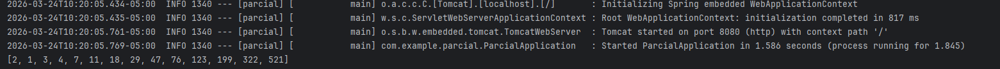

# **Parcial Práctico Segundo Tercio**

**Elaborado por**

Juan Carlos Leal Cruz

## **Secuencia de Lucas**
Para resolver el ejercicio de la Secuencia de Lucas lo que se hizo la creación de dos clases específicas que existen en pro del cálculo:
1. **`MathController`:** Expone el endpoint al cual el usuario hace el request mediante la URL haciendo uso de un `@PathVariable` para poder leer el valor ingresado.
3. **`MathService`:** Realiza el cálculo de la secuencia de lucas haciendo uso del valor ingresado por el usuario.


### **Secuencia de Lucas**
La secuencia de Lucas se calcula de la siguiente manera :

L(0)=2

L(1)=1

L(n)=L(n−1)+L(n−2), para un n≥2

**Evidencia de funcionamiento mínima**


### **Correr en local**
Para correr el proyecto en local lo que se tiene que hacer es lo siguiente:
1. Clonar el repo
   ```bash
   git clone <URL_repo>
   ```

2. Compilar el repositorio
   ```bash
   cd <repo-name>
   mvn clean compile
   ```
   

3. Instalar las dependencias
  ```bash
   mvn clean install
   ```

4. Correr el proyecto
   Para esto se puede hacer manualmente usando el botpn de Run de su IDE dentro de la clase `ParcialApplication` o usando el sigueinte comando:
   ```bash
   mvn spring-boot:run
   ```

#### **Evidencia en Local**
Se puede acceder a los endpoints haciendo uso de `http://localhost:8008/math/lucas?n=13`
- Usando n = 13
  

- Usando n = 40
  
   

## **Despliegue en Amazon**
Para realizar el despliegue en AWS se debe de crear una instancia y descargar la key para poder ingresar a ella haciendo uso de ssh.

Los parametros al momento de crear la instancia se dejan por default tal como los provee el E2C y lo único que se debe de cambiar son las reglas de seguridad de la instancia permitiendo tráfico HTTP así:


Ya luego de esta configuración procedemos de la siguiente manera
### **Instalaciones previas**
1. **Instalación de Java**
   ```bash
   sudo yum install java-17-amazon-corretto
   ```

2. **Instalación de Git**
   ```bash
   sudo yum install git -y
   ```
   
3. **Instalación de Maven**
   ```bash
   sudo yum install maven -y
   ```
### **Ingresar el proyecto a la instancia**
Para esta parte, utilizamos los mismos comandos en la sección de cómo correr el proyecto en local de tal forma que debemos hacer:
1. Clonar el repo
2. Compilar el proyecto
   
3. Instalar las dependencias
   
4. Correr el proyecto
   

Luego de seguir los pasos anteriores se ingresa a la dirección pública suministrada por la isntancia para poder hacer las pruebas de los endpoits:

